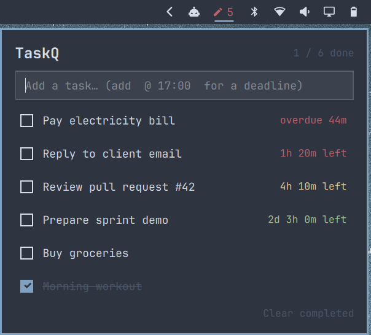

# TaskQ

**Your day, queued up, right in the [Omarchy](https://omarchy.org) bar.**

Give a task a deadline the way you'd say it, like `tomorrow 9am`, `+2h` or
`fri 17:00`, and TaskQ counts it down live: 🟢 green when there's time,
🟡 yellow when it's getting close, 🔴 red when it's urgent. Miss one and the bar
icon turns red, so nothing slips by quietly.

No app to open, no account, no cloud. It's just your tasks in one small JSON
file, matched to your Omarchy theme.



## Features

- **Lives in the bar.** It shows an icon with the number of open tasks, and
  clicking it opens the list.
- **Keyboard-first.** The text box is focused as soon as the popup opens, so
  you can type a task and press Enter.
- **Deadlines in plain words.** Type `tomorrow 9am`, `+2h`, `fri` or `12/10 17:00`.
- **Live countdown** (`2d 3h 15m left`) coloured by urgency:

  | Time left | Colour |
  |---|---|
  | Overdue, or under 2 hours | 🔴 red |
  | 2–6 hours | 🟡 yellow |
  | More than 6 hours | 🟢 green |

- **Overdue warning.** The bar icon turns red while any task is overdue.
- **Matches your theme.** It uses your Omarchy theme's colours and font.
- **Edit in place.** You can rename a task, change its deadline or delete it.
- **Plain JSON storage.** Your tasks are one readable file that's easy to
  back up or sync.

## Requirements

- Omarchy with the Quickshell-based **Omarchy shell** (the bar configured in
  `~/.config/omarchy/shell.json`). Older Waybar-based Omarchy versions are
  not supported. Tested on Omarchy 4.0.4.
- **No extra dependencies.** TaskQ only uses what the Omarchy shell already
  ships, and needs no network access or root.

## Installation

```bash
omarchy plugin add https://github.com/sendaljpt/omarchy-taskq.git --enable
```

The icon appears on the right side of the bar. To move it, for example next
to Bluetooth:

```bash
omarchy bar move sendaljpt.taskq --before omarchy.bluetooth
```

> Plugins run as normal code inside the Omarchy shell. Omarchy asks you to
> confirm before installing, and you're welcome to read the source first.
> It's three small files.

### Install by hand

```bash
git clone https://github.com/sendaljpt/omarchy-taskq.git \
  ~/.config/omarchy/plugins/sendaljpt.taskq
omarchy-shell shell rescanPlugins
omarchy plugin enable sendaljpt.taskq
```

## Usage

| Action | How |
|---|---|
| Open or close the list | Left-click the bar icon (or use a [keyboard shortcut](#keyboard-shortcut)) |
| Add a task | Type in the top box and press **Enter** |
| Add a task with a deadline | `Write report @ tomorrow 17:00` (the part after ` @ ` is the deadline) |
| Tick or untick a task | Click the task |
| Set or change a deadline | Hover over the task and click **⏱**, type, then press **Enter** |
| Rename a task | Hover over the task and click **✎**, edit, then press **Enter** |
| Delete a task | Hover over the task and click **✕** |
| Cancel an edit | **Escape** |
| Remove all finished tasks | Click **Clear completed** |
| Close the popup | **Escape** |
| Open the raw task file | Right-click the bar icon |

Open tasks are sorted by deadline, soonest first. Tasks without a deadline
come next, and completed tasks are listed last.

### Writing deadlines

While you type in the ⏱ box, a preview below it shows how your input was
read, for example `→ Sat 10 Oct 09:00 (18h 6m left)`. If it can't read the
text, it says so and doesn't save anything.

| You type | Deadline |
|---|---|
| `+2h`, `90m`, `1d 4h`, `+1d 2h 30m` | That long from now |
| `17:00`, `5pm`, `9.30` | Today at that time (tomorrow if it has already passed) |
| `today`, `tomorrow` | End of that day (23:59) |
| `tomorrow 9am`, `besok 10:00` | That day at that time (`tmr` also works) |
| `fri`, `monday 9:00` | The next such day (today, if that time is still ahead) |
| `12/10`, `12/10 17:00`, `12/10/2027` | Day/month, this year (next year if it has passed) |
| `2026-10-20`, `2026-10-20 08:30` | An exact date |
| *(empty)*, `clear`, `none` | Removes the deadline |

## Keyboard shortcut

The plugin doesn't change your keybindings. To open the list with
**Super + Shift + T**, add this to `~/.config/hypr/bindings.lua`:

```lua
o.bind("SUPER + SHIFT + T", "TaskQ", "omarchy-shell sendaljpt.taskq toggle")
```

Check that the key combination is free first, with
`omarchy menu keybindings --print`.

## Settings

### Icon

Any emoji or [Nerd Font](https://www.nerdfonts.com/cheat-sheet) glyph works:

```bash
omarchy bar set sendaljpt.taskq icon "📝"
```

The setting is stored in `~/.config/omarchy/shell.json` with the bar layout:

```json
{ "id": "sendaljpt.taskq", "icon": "📝" }
```

## Command line

You can control the widget from scripts, other keybindings or launchers:

```bash
omarchy-shell sendaljpt.taskq toggle            # open or close the popup
omarchy-shell sendaljpt.taskq open
omarchy-shell sendaljpt.taskq close
omarchy-shell sendaljpt.taskq add "Buy milk"
omarchy-shell sendaljpt.taskq add "Call bank @ tomorrow 10:00"
```

## Your data

Tasks are saved to:

```
~/.local/share/omarchy-tasks/tasks.json
```

It's plain JSON, with deadlines stored as Unix timestamps in milliseconds:

```json
[
  {
    "id": 1791474834356,
    "title": "Reply to client email",
    "done": false,
    "created": "2026-10-09T08:00:00.000Z",
    "due": 1791534845008
  }
]
```

The widget watches the file, so changes made by hand or by a sync tool (for
example Syncthing) show up straight away. Removing the plugin doesn't delete
this file.

## Troubleshooting

**Changes or a new install don't show up.** Restart the shell:

```bash
omarchy restart shell
```

**The icon isn't in the bar.** Check that the plugin is enabled and placed:

```bash
omarchy plugin list | grep tasks
omarchy plugin enable sendaljpt.taskq
omarchy bar move sendaljpt.taskq --section right
```

**Errors.** Look at the shell log:

```bash
journalctl --user -b -o cat | grep -i tasks
```

## Uninstall

```bash
omarchy plugin remove sendaljpt.taskq
rm -rf ~/.local/share/omarchy-tasks    # optional: also delete your tasks
```

If you added the keyboard shortcut, remove that line from
`~/.config/hypr/bindings.lua`.

## How it works

| File | Purpose |
|---|---|
| `manifest.json` | Plugin metadata for the Omarchy shell: id, bar widget entry point, settings |
| `BarWidget.qml` | The bar icon and counter. It also owns the task data (load, save, add, edit, deadlines) |
| `Panel.qml` | The popup: input, task rows, countdowns and inline editors |
| `Due.js` | Plain JavaScript that reads deadlines and formats countdowns |

`Due.js` doesn't depend on QML, so you can test it with Node:

```bash
(tail -n +2 Due.js; echo 'module.exports = { parse, countdown, describe }') > /tmp/due.cjs
node -e 'const D = require("/tmp/due.cjs"); const d = D.parse("tomorrow 9am"); console.log(D.describe(d), D.countdown(d, Date.now()))'
```

## Contributing

Issues and pull requests are welcome. To work on the plugin, clone it into
`~/.config/omarchy/plugins/sendaljpt.taskq`. The shell reloads plugin code
when you save, and if a change doesn't appear, run `omarchy restart shell`.

## License

[MIT](LICENSE)
